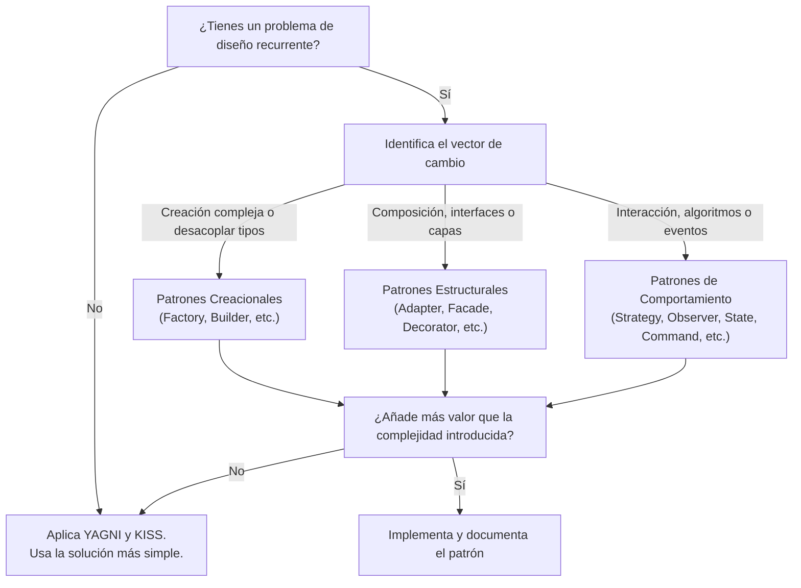

# Braindump: Catálogo y Matriz de Decisión de los 23 Patrones de Diseño GoF (Cuándo Usar y Cuándo NO Usar)

## Raw Thoughts
```text
Catalogo de patrones de diseño.
Los patrones GoF son 23 y se dividen en creacionales, estructurales y de comportamiento.
Los patrones se clasifican de acuerdo al proposito(Que hace un patron):
1.- Creacion: Creacion de objetos
2.- Estructural: Composicion de clases u objetos.
3.- Comportamiento: Modo en que las clases u objetos interactuan y se reparten la resposabilidad.

Creacionales: Singleton, Factory Method, Abstract Factory, Builder, Prototype.
Estructurales: Adapter, Bridge, Composite, Decorator, Facade, Flyweight, Proxy.
Comportamiento: Chain of Responsibility, Command, Interpreter, Iterator, Mediator, Memento, Observer, State, Strategy, Template Method, Visitor.

Abstract Factory (Fabrica abstracta).
	Proporciona una interfaz para crear familias de objetos relaciondos o que dependen entre si, 
	sin especificar sus clases concretas.
Adapter(Adaptador).
	Convierte la interz de una clase en otra distinta que es la que esperan los clientes . 
	Permite que cooperen las clases  que de otra manera no podrian por tener interfaces incompatibles.
Brigue(Puente).
	Desacopla una abstraccion de su implementacion, de manera que ambas puedas variar de forma independiente.
Builder (Contructor).
	Separa la construccion de un objeto complejo de su representacion, de forma que el mismo proceso de construccion 
	pueda crear diferentes representaciones.
Chain of Responsibility (Cadena de responsabilidad).
	Evita acoplar el emisor de una peticion a su receptor, al dar a mas de un objeto la responsabilidad de 	
	responder la peticion. Crea una cadena con los objetos receptores y pasa la peticion a traves de la
	cadena hasta que esta sea tratada por algun objeto.
Command(orden).
	Encapsula una peticion en un objeto, permitiendo asi parametrizar a los clientes con distintas peticiones,
	encolar o llevar un registro de las peticiones y poder deshacer las operaciones.
Composite(compuesto).
	Conbina objetos en estructuras de arbol para respresentar jerarquias de parte-todo. Permite que los clientes
	traten de manera uniforme a los objetos individuales y a los copuestos.
Decorator (Decorador).
	Añade dinamicamente nuevas responsabilidades a un objeto, proporcionando una alternativa flexible a la 
	herencia para extender la funcionalidad.
Facade (Fachada)
	Porporciona una interfaz unificada para un conjunto de interfaces de un subsistema. Define una interfaz 
	de alto nivel que hace que el subsistema sea mas facil de usar.
Factory Method (Metodo de fabricacion ).
	Define una interfaz para crear un objeto, pero deja que sean las subclases quienes decidan que clases
	instanciar. Permie que una clase delegue en sus subclases la creacion de objetos.
Flyweight (Peso ligero).
	Usa el compartimiento para permitir un gran numero de objetos de grano fino de forma eficiente.
Interpreter (Interprete).
	Dado un lenguaje, define una representacion de su gramatica junto con un interprete que usa dicha 
	representacion para interpretar sentencias del lenguaje.
Iterator (Iterador).
	Proporciona un modo de acceder secuencialemte a los elemento de un objeto agregado sin exponer su
	representacion interna.
Mediator (Mediador).
	Define un objeto que encapsula como interactuan un conjuntos de objetos. Promueve un bajo acoplamiento
	al evitar que los objetos se refieran uno a otros explicitamente, y permite variar la interaccion entre
	ellos de forma independiente.
Memento (Recuerdo).
	Representa y externaliza el estado interno de un objeto sin violar la encapsulacion, de forma que este
	pueda volver a dicho estado mas tarde.
Observer (Observador).
	Define una dependencia de uno-a-muchos entre objetos, de forma que cuando un objeto cambie de estado se
	notifica o se actualizan automaticamente todos los objetos que dependan de el.
Prototype (Prototipo).
	Especifica los tipos de objetos a crear por medio de una  instancia prototipica y crean nuevos objetos 
	copiando de este prototipo.
Proxy (Apoderado).
	Proporciona un sustituto o representante de otro objeto para controlar el acceso a este.
Singleton (Unico).
	Garantiza que una clase solo tenga una instancia, y proporciona un punto de acceso global a ella.
State (estado).
	Permite que un objeto modifique su comportamiento cada vez que cambie su estado interno. Parecera 
	que cambia la clase del objeto.
Strategy (Estrategia).
	Define una familia de algoritmos, encapsula cada uno de ellos y lo s hace intercambiables. 
	Permite que un algoritmo varie independientemente de los clientes que lo usan.
Template Method (Metodo Plantilla).
	Define en una operacion el esqueleto de un algoritmo, delegando en las subclases algunos de sus pasos.
	Permite que las subclases redefinan ciertos pasos del algoritmo sin cambiar su etructura.
Visitor (Visitante).
	Representa una operacion sobre los elementos de una estructura de objetos. Permite definir una nueva
	operacion sin cambiar las clases de los elementos sobre los que opera.
	
Quiero entender realmente cuándo usar cada uno y cuándo no usarlo.
```

---

## Content Analysis

### Main Themes
1. **Taxonomía GoF (Gang of Four):** Clasificación canónica de los 23 patrones en Creacionales (5), Estructurales (7) y de Comportamiento (11).
2. **Criterio de Decisión Práctico (Cuándo SÍ vs. Cuándo NO):** Necesidad de trascender la definición teórica para entender los trade-offs de diseño, señales de dolor en el código y riesgos de sobreingeniería.
3. **Mapeo de Complejidad vs. Flexibilidad:** Identificar cómo cada patrón desacopla una dimensión de variación específica (creación, estructura o interacción) a costa de añadir niveles de indirección.

### Supporting Ideas
- Los patrones no son metas, sino herramientas para resolver fuerzas de tensión arquitectónica (acoplamiento, extensibilidad, testeabilidad, rendimiento).
- Muchos patrones tienen equivalencias o sustitutos en paradigmas modernos (inyección de dependencias, funciones de orden superior, programación reactiva, inmutabilidad).

### Questions Raised
- ¿Cuáles son las banderas rojas (*code smells*) que indican que se está forzando un patrón donde no se necesita (*Patternitis*)?
- ¿Qué patrones siguen siendo de uso diario en desarrollo moderno y cuáles han sido absorbidos por los lenguajes/frameworks actuales?

### Decisions Contemplated
- Establecer una matriz de decisión pragmática para la arquitectura y el diseño técnico del equipo/proyectos.

---

## Strategic Intelligence: Matriz Canónica de los 23 Patrones GoF

### 1. Patrones Creacionales (5)

#### 1.1. Factory Method
- **Intención:** Define una interfaz de creación pero delega la instanciación a las subclases o métodos de fábrica concretos.
- **Cuándo SÍ usarlo:**
  - Cuando no conoces de antemano las clases exactas y dependencias de los objetos con los que debe trabajar tu código.
  - Cuando quieres que los usuarios de tu biblioteca o framework puedan extender sus componentes internos.
  - Para centralizar la lógica de instanciación y desacoplar el código cliente de clases concretas.
- **Cuándo NO usarlo:**
  - Cuando la clase es simple, no tiene variantes y no planeas extenderla (usar un constructor directo `new` es suficiente).
  - Si sólo introduce una jerarquía paralela de creadores innecesaria para 1 o 2 clases estables.

#### 1.2. Abstract Factory
- **Intención:** Proporciona una interfaz para crear familias de objetos relacionados o dependientes sin especificar sus clases concretas.
- **Cuándo SÍ usarlo:**
  - Cuando el sistema debe ser independiente de cómo se crean sus productos y debe trabajar con **múltiples familias de productos compatibles** (ej. UI Themes: `LightButton`/`LightDialog` vs. `DarkButton`/`DarkDialog`; o drivers de base de datos `PostgresConnection`/`PostgresCommand` vs. `MongoConnection`/`MongoCommand`).
- **Cuándo NO usarlo:**
  - Si sólo necesitas crear una única clase de producto (usa Factory Method).
  - Si la familia de productos cambia frecuentemente añadiendo nuevos tipos de productos (requiere modificar la interfaz abstracta y todas las fábricas concretas).

#### 1.3. Builder
- **Intención:** Separa la construcción de un objeto complejo de su representación, permitiendo construirlo paso a paso.
- **Cuándo SÍ usarlo:**
  - Para evitar el antipatrón de "Constructores Telescópicos" (constructores con 6+ parámetros opcionales/nulos).
  - Cuando necesitas construir objetos inmutables con configuraciones complejas o validaciones por etapas.
  - Creación de representaciones complejas (ej. generadores de HTML, ASTs, queries SQL dinámicas).
- **Cuándo NO usarlo:**
  - Para objetos simples con 2 o 3 propiedades donde los parámetros por defecto o un objeto de configuración (`options object`) bastan.
  - Si el objeto es puramente mutable y un simple DTO.

#### 1.4. Prototype
- **Intención:** Crea nuevos objetos clonando una instancia prototípica existente en lugar de instanciar desde cero.
- **Cuándo SÍ usarlo:**
  - Cuando el costo de crear un objeto desde cero es muy costoso (llamadas a BD, parsing pesado de configuraciones, clonación de estados gráficos/juegos).
  - Cuando quieres desacoplar el cliente de las clases concretas que necesita duplicar.
- **Cuándo NO usarlo:**
  - Para objetos simples o con grafos de dependencias circulares complejas (la clonación profunda / *deep clone* se vuelve propensa a bugs).
  - Si el lenguaje ya tiene mecanismos nativos de clonación o inmutabilidad estructural directa.

#### 1.5. Singleton
- **Intención:** Garantiza que una clase tenga una sola instancia y proporciona un punto de acceso global.
- **Cuándo SÍ usarlo:**
  - Control de acceso estricto a un recurso compartido físico/externo (ej. pool de conexiones de hardware, spooler de impresión).
- **Cuándo NO usarlo:**
  - **Antipatrón común en código moderno:** Dificulta los Unit Tests (introduce estado global mutable), oculta dependencias y genera cuellos de botella en concurrencia.
  - **Alternativa moderna:** Registrar la clase con ciclo de vida *Singleton* mediante un Contenedor de Inyección de Dependencias (IoC/DI).

---

### 2. Patrones Estructurales (7)

#### 2.1. Adapter
- **Intención:** Convierte la interfaz de una clase en otra interfaz que el cliente espera.
- **Cuándo SÍ usarlo:**
  - Cuando integras una librería de terceros o un sistema legado cuya interfaz no encaja con el resto de tu arquitectura (Arquitectura Hexagonal / Puertos y Adaptadores).
  - Para aislar tu dominio de cambios en contratos de APIs externas.
- **Cuándo NO usarlo:**
  - Si tienes control total del código fuente de ambas clases y puedes refactorizarlas directamente para compartir una interfaz común.

#### 2.2. Bridge
- **Intención:** Desacopla una abstracción de su implementación para que ambas puedan evolucionar independientemente (evita la explosión combinatoria de clases).
- **Cuándo SÍ usarlo:**
  - Cuando tienes dos dimensiones ortogonales de variación (ej. `Forma` [Círculo, Cuadrado] y `Renderizador` [Vectorial, Rasterizado] -> en vez de 4 subclases, creas 2 jerarquías independientes).
  - Cuando necesitas cambiar implementaciones en tiempo de ejecución.
- **Cuándo NO usarlo:**
  - Cuando sólo tienes una implementación y no hay indicios de que la dimensión de implementación vaya a multiplicarse (sobreabstracción prematura).

#### 2.3. Composite
- **Intención:** Compone objetos en estructuras de árbol para representar jerarquías parte-todo, tratando nodos individuales y compuestos de manera uniforme.
- **Cuándo SÍ usarlo:**
  - Para estructuras jerárquicas o anidadas (sistemas de archivos, árboles de UI / DOM, menús con submenús, nodos de cálculo de precios con descuentos anidados).
- **Cuándo NO usarlo:**
  - Si los componentes tienen operaciones radicalmente distintas y no tiene sentido tratarlos bajo una interfaz uniforme (rompe el principio de segregación de interfaces).

#### 2.4. Decorator
- **Intención:** Añade responsabilidades a objetos dinámicamente mediante composición en lugar de herencia.
- **Cuándo SÍ usarlo:**
  - Cuando necesitas agregar comportamientos combinables o capas opcionales (ej. `Stream` -> `BufferedStream` -> `GzipStream` -> `EncryptedStream`).
  - Para cumplir con el Principio Abierto/Cerrado (OCP) sin crear una explosión de subclases.
- **Cuándo NO usarlo:**
  - Cuando el orden de los decoradores no importa pero la interfaz tiene demasiados métodos (tendrás que delegar docenas de llamadas en cada wrapper).
  - Cuando necesitas inspeccionar el tipo concreto subyacente (el decorador oculta la identidad del objeto interno).

#### 2.5. Facade
- **Intención:** Proporciona una interfaz simple y unificada para un subsistema complejo de clases.
- **Cuándo SÍ usarlo:**
  - Para ofrecer una puerta de entrada simple a una biblioteca compleja o subsistema legado (ej. un servicio `CheckoutFacade` que coordina `PaymentGateway`, `InventoryService`, `NotificationService` y `TaxCalculator`).
  - Para establecer capas de arquitectura limpias entre módulos.
- **Cuándo NO usarlo:**
  - Si la fachada intenta convertirse en un "God Object" que sabe y hace todo.
  - Cuando los clientes necesitan control granular y directo sobre las opciones avanzadas del subsistema.

#### 2.6. Flyweight
- **Intención:** Minimiza el uso de memoria compartiendo eficientemente el estado intrínseco (común) entre miles/millones de objetos de grano fino.
- **Cuándo SÍ usarlo:**
  - Aplicaciones con restricciones severas de memoria que manejan millones de objetos repetitivos (renderizado de tipografía/glifos, partículas en videojuegos, celdas de hojas de cálculo masivas).
- **Cuándo NO usarlo:**
  - Si la memoria no es un cuello de botella crítico medido y demostrado (añade complejidad innecesaria dividiendo estado intrínseco de extrínseco).

#### 2.7. Proxy
- **Intención:** Proporciona un sustituto o intermediario para controlar el acceso a otro objeto.
- **Cuándo SÍ usarlo:**
  - **Lazy loading / Virtual Proxy:** Cargar recursos pesados sólo cuando se usan por primera vez.
  - **Protection / Auth Proxy:** Validar permisos antes de invocar el servicio real.
  - **Remote Proxy / Caching Proxy:** Cachear respuestas o manejar llamadas RPC transparentemente.
- **Cuándo NO usarlo:**
  - Si agrega una capa de indirección vacía sin valor de negocio ni control de acceso.

---

### 3. Patrones de Comportamiento (11)

#### 3.1. Chain of Responsibility
- **Intención:** Pasa una solicitud a lo largo de una cadena de manejadores hasta que uno la procese o se termine la cadena.
- **Cuándo SÍ usarlo:**
  - Middlewares web (filtros de autenticación, logging, validación, CORS, rate limiting).
  - Sistemas de aprobación jerárquicos o resolución de soporte escalonado.
- **Cuándo NO usarlo:**
  - Si cada petición DEBE ser procesada exactamente por un manejador conocido de antemano (usa Strategy o Polimorfismo directo).
  - Si la cadena puede crecer descontroladamente y causar problemas de rendimiento o dificultad de debugging (la petición puede perderse sin manejador).

#### 3.2. Command
- **Intención:** Encapsula una acción como un objeto, desacoplando el emisor del receptor.
- **Cuándo SÍ usarlo:**
  - Implementación de operaciones **Deshacer/Rehacer (Undo/Redo)**.
  - Encolamiento de tareas, background jobs, transacciones diferidas, logs de auditoría de comandos (CQRS / Event Sourcing).
- **Cuándo NO usarlo:**
  - Para invocaciones directas y síncronas simples donde una llamada a método o función de primera clase (`callback`) es suficiente.

#### 3.3. Interpreter
- **Intención:** Define la gramática de un lenguaje sencillo y un intérprete para evaluar sus expresiones.
- **Cuándo SÍ usarlo:**
  - Motores de reglas de negocio en DSLs (Domain Specific Languages) simples, evaluadores de fórmulas matemáticas básicas o expresiones de filtrado tipo SQL simplificado.
- **Cuándo NO usarlo:**
  - Para lenguajes o gramáticas complejas (se vuelve inmanejable; es mejor usar generadores de parsers como ANTLR o Lex/Yacc).

#### 3.4. Iterator
- **Intención:** Accede secuencialmente a los elementos de una colección sin exponer su representación subyacente.
- **Cuándo SÍ usarlo:**
  - Cuando creas una estructura de datos personalizada (árbol, grafo, ring buffer) y quieres que se recorra de forma estándar (`for...of`, `foreach`, `Iterable`).
- **Cuándo NO usarlo:**
  - Para listas o arrays estándar donde el lenguaje ya provee iteradores nativos e inmutables (ej. `map`, `filter`, `reduce`).

#### 3.5. Mediator
- **Intención:** Centraliza las comunicaciones complejas y las dependencias mutuas entre un conjunto de objetos para evitar dependencias cruzadas (espagueti many-to-many).
- **Cuándo SÍ usarlo:**
  - Formularios complejos o wizards donde el cambio en un input afecta la visibilidad y estado de 10 componentes distintos.
  - Arquitecturas de eventos desacopladas (ej. MediatR en .NET, Event Buses en CQRS).
- **Cuándo NO usarlo:**
  - Si el Mediador se convierte en un monolito que concentra toda la lógica de negocio del sistema.

#### 3.6. Memento
- **Intención:** Captura y restaura el estado interno de un objeto sin violar su encapsulamiento.
- **Cuándo SÍ usarlo:**
  - Snapshots de estado, checkpoints para rollbacks transaccionales, historial de edición para "restaurar versión anterior".
- **Cuándo NO usarlo:**
  - Si el objeto contiene estructuras masivas y clonar el estado consume demasiada memoria RAM (sin control de diffs/deltas).
  - En arquitecturas donde los estados ya son inmutables por diseño.

#### 3.7. Observer
- **Intención:** Define una suscripción uno-a-muchos: cuando un sujeto cambia de estado, todos sus observadores son notificados.
- **Cuándo SÍ usarlo:**
  - Arquitecturas orientadas a eventos (Pub/Sub), interfaces reactivas (modelos UI que actualizan vistas), webhooks y listeners.
- **Cuándo NO usarlo:**
  - Si el flujo de datos es estrictamente lineal y síncrono.
  - Cuidado con "memory leaks" por observadores no desuscritos (*Lapsed Listener Problem*).

#### 3.8. State
- **Intención:** Permite que un objeto altere su comportamiento cuando cambia su estado interno, pareciendo cambiar de clase.
- **Cuándo SÍ usarlo:**
  - Máquinas de estados finitos (FSM) donde el comportamiento varía radicalmente según el estado (ej. Pedido: `Borrador` -> `Pagado` -> `Enviado` -> `Cancelado`) para eliminar bloques gigantes de `switch / if-else`.
- **Cuándo NO usarlo:**
  - Si el objeto sólo tiene 2 o 3 estados con transiciones mínimas que se resuelven limpiamente con un condicional simple.

#### 3.9. Strategy
- **Intención:** Define una familia de algoritmos intercambiables y los encapsula en clases separadas.
- **Cuándo SÍ usarlo:**
  - Cuando tienes múltiples variantes de un algoritmo (ej. Estrategias de cálculo de impuestos, métodos de ordenamiento, proveedores de pago: Stripe vs PayPal vs MercadoPago).
  - Para eliminar condicionales complejos y adherirse al principio Abierto/Cerrado (OCP).
- **Cuándo NO usarlo:**
  - Si las variantes no cambian nunca y sólo añaden clases innecesarias para un cálculo de una sola línea.

#### 3.10. Template Method
- **Intención:** Define el esqueleto de un algoritmo en una clase base y delega pasos específicos a las subclases.
- **Cuándo SÍ usarlo:**
  - Cuando varios procesos siguen exactamente los mismos pasos generales pero difieren en 1 o 2 detalles concretos (ej. Pipelines ETL: `extraer()` -> `transformar()` -> `cargar()`).
  - Creación de frameworks y extensiones ("Hollywood Principle": *Don't call us, we'll call you*).
- **Cuándo NO usarlo:**
  - Si la herencia crea un acoplamiento rígido entre la clase base y las subclases (a menudo es preferible usar **Strategy + Composición**).

#### 3.11. Visitor
- **Intención:** Permite agregar nuevas operaciones a una jerarquía de clases existente sin modificar dichas clases (doble despacho / *double dispatch*).
- **Cuándo SÍ usarlo:**
  - En estructuras de datos estables donde necesitas ejecutar muchas operaciones distintas y cambiantes (ej. Árboles de sintaxis abstracta [AST] donde quieres añadir: `TypeCheckerVisitor`, `CodeGeneratorVisitor`, `PrettyPrinterVisitor`).
- **Cuándo NO usarlo:**
  - Si la jerarquía de clases cambia frecuentemente (cada vez que agregas una clase nueva a la jerarquía, debes modificar TODAS las interfaces e implementaciones de Visitors).

---

## Strategic Implications & Regla de Oro Arquitectónica



> [!IMPORTANT]
> **La Ley de la Necesidad Emergente:** Nunca introduzcas un patrón de diseño por anticipación en la fase inicial del código. Escribe código simple, legible y directo; luego, cuando observes duplicación de lógica, rigidez ante cambios o proliferación de condicionales, **refactoriza hacia el patrón correspondiente**.

---

## Action Items

### Immediate (24-48 hours)
- [ ] Consolidar esta matriz en la base de conocimiento permanente de patrones en `05-knowledge/patterns/` 📅 2026-08-16

### Short-term (1-2 weeks)
- [ ] Mapear equivalencias modernas: cómo la Inyección de Dependencias, Lambdas y Arquitecturas Orientadas a Eventos reemplazan o potencian estos patrones 📅 2026-08-22

---

## Connections
- **Knowledge Base:** [[05-knowledge/patterns/gof-patterns-decision-matrix|Matriz de Decisión GoF]]
- **Tags:** `#software-architecture` `#design-patterns` `#gof` `#clean-code` `#refactoring`

## Domain Classification
- **Primary Domain:** professional (100%)
- **Reasoning:** Conocimiento fundamental de ingeniería de software, arquitectura de sistemas y diseño orientado a objetos.
- **Privacy Level:** private

## Processing Notes
### Emotional Context
- **Energy Level:** medium
- **Emotional Tone:** curious / analytical
- **Implications:** Búsqueda de claridad pragmática para la toma de decisiones técnicas y eliminación de ambigüedad teórica.

### Confidence Assessment
- **Overall Analysis:** 98% - Mapeo canónico riguroso con enfoque en trade-offs reales de la industria.
- **Domain Classification:** 100% - Claramente profesional / ingeniería de software.
- **Strategic Insights:** 95% - Enfoque orientado a evitar sobreingeniería y guiar refactorizaciones efectivas.

---

*Processed by COG Brain Dump Analyst*
