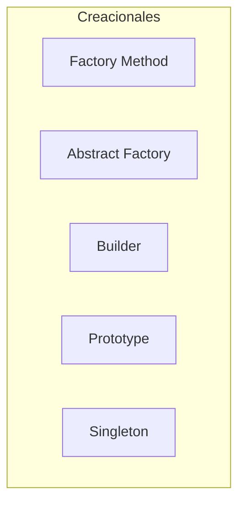
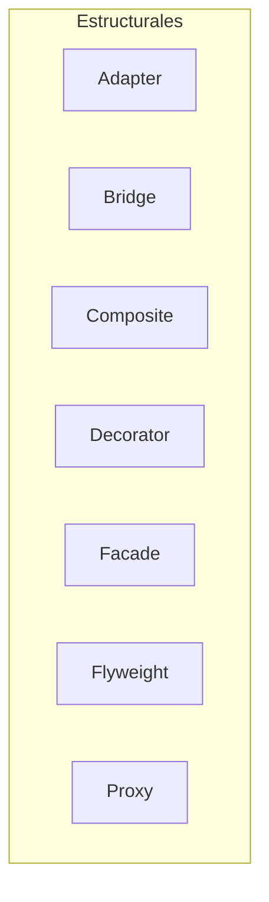
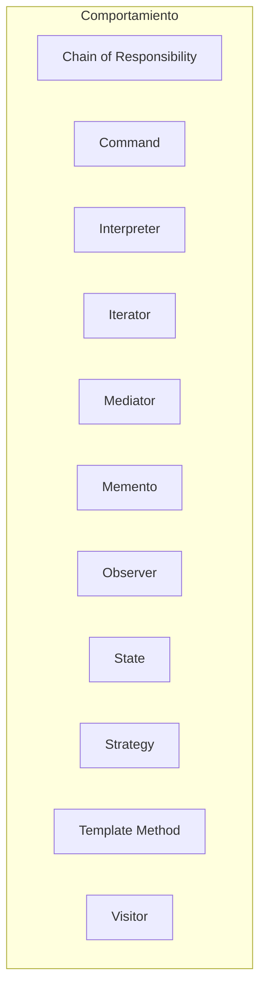
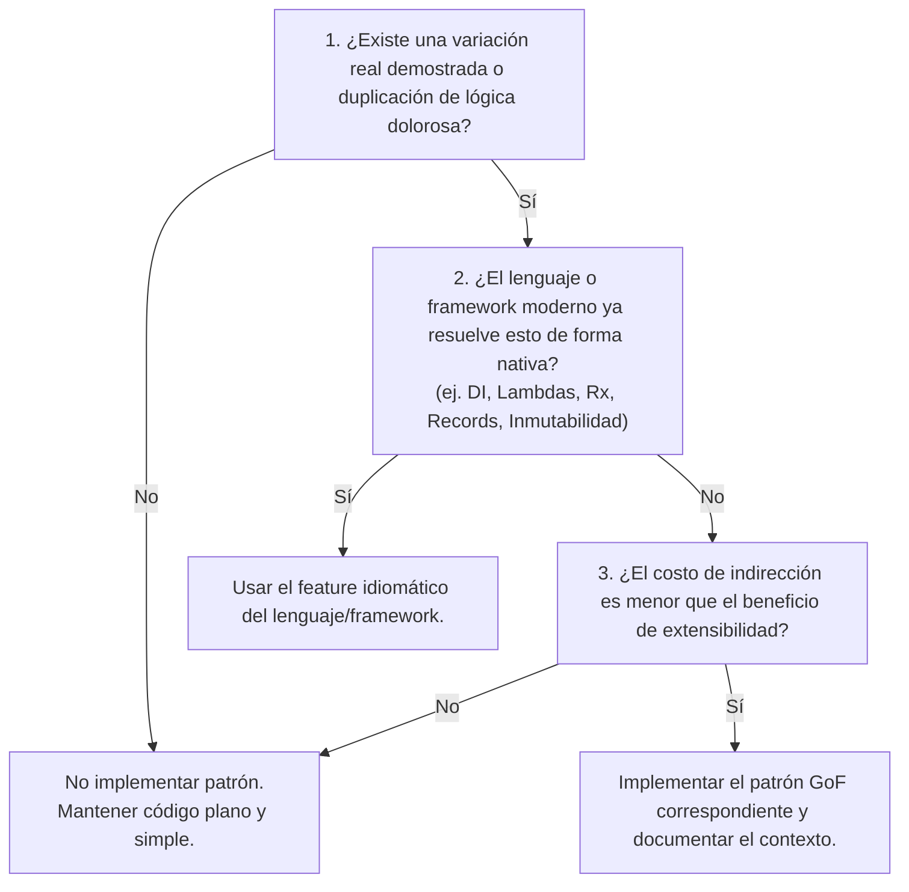

# Framework: Matriz de Decisión y Trade-Offs de los 23 Patrones GoF

## Framework Overview
Este framework proporciona un modelo mental pragmático y una matriz de decisión exhaustiva para evaluar cuándo aplicar y cuándo evitar cada uno de los 23 patrones de diseño canónicos de *Gang of Four* (GoF). Su objetivo es eliminar la *Patternitis* (sobreingeniería anticipada) y guiar al arquitecto o tech lead en la selección rigurosa basada en trade-offs, desacoplamiento y fuerzas de diseño reales.

**Status:** Working  
**Last Updated:** 2026-08-15  
**Source Insights:** 1 documento analizado ([[03-professional/braindumps/braindump-2026-08-15-2257-catalogo-patrones-gof|braindump-2026-08-15-2257-catalogo-patrones-gof]])

---

## Core Principles

### Principle 1: La Ley de la Necesidad Emergente (Refactoring vs. Premature Design)
**Statement:** Un patrón de diseño no debe introducirse de manera preventiva en la arquitectura inicial. Debe introducirse como un refactor cuando una fuerza de diseño específica (duplicación, acoplamiento excesivo, explosión de condicionales) genere fricción real demostrada.

**Evidence:**
- [[03-professional/braindumps/braindump-2026-08-15-2257-catalogo-patrones-gof|braindump-2026-08-15-2257-catalogo-patrones-gof]] - Demanda explícita de distinguir entre teoría y señales de dolor reales en el código.

**Evolution:** Consolidado como heurística rectora para equilibrar KISS/YAGNI con extensibilidad a largo plazo.

**Confidence:** High - Alineado con las mejores prácticas de Extreme Programming y Clean Architecture.

---

### Principle 2: Aislamiento por Vector de Variación
**Statement:** Cada familia de patrones resuelve un vector ortogonal de cambio en el software:
1. **Creacionales:** Desacoplan al cliente del modo y momento en que los objetos cobran vida.
2. **Estructurales:** Desacoplan la jerarquía y composición física de las clases de su uso lógico.
3. **De Comportamiento:** Desacoplan el emisor de una acción del algoritmo, receptor o flujo de control que la procesa.

**Evidence:**
- [[03-professional/braindumps/braindump-2026-08-15-2257-catalogo-patrones-gof|braindump-2026-08-15-2257-catalogo-patrones-gof]] - Taxonomía formal categorizada por propósito y responsabilidad.

**Confidence:** High - Es la base estructural del diseño orientado a objetos y modular.

---

### Principle 3: Presupuesto de Indirección (Trade-off de Complejidad)
**Statement:** Todo patrón introduce niveles adicionales de indirección (interfaces, wrappers, delegaciones). Si la variabilidad que el patrón busca encapsular no cambia en el tiempo de vida del proyecto, la indirección se convierte en deuda técnica pura.

**Evidence:**
- [[03-professional/braindumps/braindump-2026-08-15-2257-catalogo-patrones-gof|braindump-2026-08-15-2257-catalogo-patrones-gof]] - Criterios de exclusión específicos para patrones como Singleton, Visitor, Flyweight y Bridge.

**Confidence:** High.

---

## Catálogo de Decisión: Los 23 Patrones GoF

### 1. Patrones Creacionales (5)

| Patrón | Propósito Central | Cuándo SÍ Usar (Señales de Dolor) | Cuándo NO Usar (Riesgos / Antipatrón) | Alternativa Moderna |
| :--- | :--- | :--- | :--- | :--- |
| **Factory Method** | Delega la instanciación a métodos polimórficos. | No conoces los tipos concretos de antemano; diseño de frameworks/librerías abiertas a extensión. | Clases simples sin variantes estables. | Constructor directo `new` o funciones factory puras. |
| **Abstract Factory** | Crea familias completas de objetos dependientes sin acoplar clases concretas. | Sistemas multi-plataforma o multi-driver (ej. UI Dark/Light, SQL Postgres vs Oracle). | Productos individuales sin dependencias familiares entre sí. | Inyección de dependencias modular por perfil/configuración. |
| **Builder** | Construye objetos complejos paso a paso con configuración granular. | Constructores telescópicos (>4 parámetros opcionales), objetos inmutables complejos, queries fluidas. | DTOs simples o estructuras planas mutables. | Objeto de opciones / *Options pattern*, Records inmutables. |
| **Prototype** | Clona instancias prototípicas existentes. | Costo de inicialización extremadamente alto (parsing, I/O pesado); clonar grafos en memoria. | Objetos simples o grafos con referencias circulares complejas. | *Deep clone* nativo, copia superficial (`spread` / `.clone()`). |
| **Singleton** | Garantiza una única instancia con acceso global. | Coordinación estricta de hardware físico exclusivo (spooler, driver serial). | Estado global mutable, servicios de negocio, DAOs (destruye testabilidad). | Ciclo de vida Singleton gestionado por Contenedor IoC / DI. |

---

### 2. Patrones Estructurales (7)

| Patrón | Propósito Central | Cuándo SÍ Usar (Señales de Dolor) | Cuándo NO Usar (Riesgos / Antipatrón) | Alternativa Moderna |
| :--- | :--- | :--- | :--- | :--- |
| **Adapter** | Adapta una interfaz incompatible al contrato esperado por el cliente. | Integración de SDKs de terceros, APIs externas o sistemas legados (Puertos y Adaptadores). | Cuando tienes control total de ambas clases y puedes refactorizar directamente. | Funciones de mapeo puro / *Data Transformers*. |
| **Bridge** | Separa abstracción de implementación para permitir que ambas varíen independientemente. | Dos dimensiones independientes de cambio (ej. Formas geométricas × Plataformas de renderizado). | Jerarquías estables donde la implementación nunca variará. | Composición de interfaces simples. |
| **Composite** | Trata elementos individuales y colecciones anidadas de forma uniforme. | Estructuras en árbol (árboles DOM, menús multinivel, pipelines de validación jerárquicos). | Cuando los elementos tienen operaciones incompatibles entre sí. | Estructuras algebraicas de datos / *Tagged unions*. |
| **Decorator** | Añade dinámicamente responsabilidades mediante composición envolvente. | Capas combinables (compresión + cifrado + buffering en streams, middlewares de logging/auth). | Cuando la interfaz tiene docenas de métodos (requiere *forwarding boilerplate* masivo). | Middlewares funcionales, AOP (Aspect Oriented Programming), Decoradores de lenguaje. |
| **Facade** | Proporciona una interfaz simple y unificada sobre un subsistema complejo. | Simplificar la API de módulos complejos o subsistemas legados hacia el exterior. | Cuando se transforma en un "God Object" que concentra toda la lógica. | Servicios de aplicación / *Orchestrators* de dominio. |
| **Flyweight** | Comparte estado intrínseco común entre millones de objetos para ahorrar memoria. | Restricciones críticas de memoria con millones de objetos idénticos (ej. glifos tipográficos, celdas). | Si la memoria no es un cuello de botella comprobado con profiling. | *String pooling*, estructuras de datos orientadas a arrays (*Data-Oriented Design*). |
| **Proxy** | Controla el acceso a un objeto mediante un sustituto. | Carga perezosa (*lazy loading*), verificación de permisos, caché transparente, stubs remotos. | Indirección vacía sin valor de negocio ni seguridad. | *Dynamic Proxies* nativos, Interceptores de contenedor DI. |

---

### 3. Patrones de Comportamiento (11)

| Patrón | Propósito Central | Cuándo SÍ Usar (Señales de Dolor) | Cuándo NO Usar (Riesgos / Antipatrón) | Alternativa Moderna |
| :--- | :--- | :--- | :--- | :--- |
| **Chain of Responsibility** | Pasa una petición a lo largo de una cadena de manejadores potenciales. | Pipelines de filtrado (Auth, CORS, Rate Limit), sistemas de aprobación escalonada. | Cuando la petición debe ser procesada por un receptor único exacto. | Pipelines funcionales (`pipe`, middleware arrays). |
| **Command** | Encapsula una acción como un objeto autónomo. | Historial Deshacer/Rehacer (*Undo/Redo*), encolamiento de background jobs, CQRS/Event Sourcing. | Invocaciones síncronas simples y directas. | Funciones de orden superior / *lambdas* con callbacks. |
| **Interpreter** | Evalúa sentencias definidas en una gramática de lenguaje específico. | DSLs simples, evaluadores de fórmulas o reglas de negocio parametrizables. | Gramáticas complejas o lenguajes completos. | Parsers formales (ANTLR, Lex/Yacc, PEG.js). |
| **Iterator** | Recorre colecciones agregadas sin exponer su estructura interna. | Colecciones personalizadas complejas (árboles B, grafos, estructuras paginadas). | Arrays o listas básicas donde el lenguaje ya provee soporte nativo. | Protocolos de iteración nativos (`Symbol.iterator`, `IEnumerable`). |
| **Mediator** | Centraliza la comunicación compleja entre múltiples componentes. | Formularios UI interactivos complejos, orquestación de eventos desacoplada en CQRS. | Cuando el mediador concentra toda la lógica y se vuelve un monolito difícil de mantener. | Event Buses ligeros, React Context, RxJS subjects. |
| **Memento** | Captura y restaura el estado interno de un objeto sin romper encapsulamiento. | Snapshots de estado, checkpoints transaccionales, restauración de borradores. | Objetos gigantes donde clonar memoria genera sobrecarga excesiva. | Inmutabilidad de estado (Redux, Immer, persistencia estructural). |
| **Observer** | Notificación uno-a-muchos cuando el estado del sujeto cambia. | Arquitecturas orientadas a eventos (Pub/Sub), UI reactiva data-binding, webhooks. | Flujos lineales síncronos simples (*memory leaks* por listeners huérfanos). | Programación Reactiva (RxJS), EventEmitters, Signals. |
| **State** | Cambia el comportamiento del objeto según su estado interno simulando cambio de clase. | Máquinas de Estados Finitos (FSM) con transiciones complejas y muchos estados. | Objetos con 2 estados simples resueltos con un condicional básico. | Librerías formales de FSM (ej. XState), Pattern Matching en lenguajes modernos. |
| **Strategy** | Encapsula familias de algoritmos intercambiables en tiempo de ejecución. | Múltiples variantes de cálculo (impuestos, gateways de pago, estrategias de routing). | Algoritmos fijos que nunca variarán. | Funciones puras pasadas como argumentos (*Higher-Order Functions*). |
| **Template Method** | Define el esqueleto de un algoritmo delegando pasos específicos a subclases. | Procesos invariantes con pasos concretos variables (Pipelines ETL, frameworks). | Acoplamiento rígido por herencia. | Composición con **Strategy** o funciones de paso. |
| **Visitor** | Añade operaciones a estructuras de objetos sin modificar sus clases. | Estructuras de datos estables donde se añaden operaciones frecuentes (ASTs, compiladores). | Jerarquías de clases que cambian frecuentemente (rompe el contrato de todos los Visitors). | *Pattern Matching* sobre tipos suma / Uniones discriminadas. |

---

## Applications & Decision Heuristic

### Protocolo de Evaluación Arquitectónica

Antes de implementar un patrón en el código base, el arquitecto / tech lead debe responder las siguientes 3 preguntas:

---

## Boundaries & Limitations

**Este framework es altamente efectivo cuando:**
- Se audita deuda técnica o refactorizan módulos monolíticos complejos.
- Se definen directrices de diseño y guías técnicas para equipos de desarrollo.
- Se diseñan librerías compartidas, SDKs internos o frameworks de infraestructura.

**Este framework NO aplica cuando:**
- Se trabaja en prototipos rápidos o MVPs donde el vector de cambio es incierto y la velocidad de iteración prima sobre la abstracción.
- El equipo cae en la trampa de "diseño por catálogo", queriendo usar todos los patrones como checklist.

---

## Related Frameworks
- `[[05-knowledge/patterns/pattern-emergent-design-vs-patternitis|Pattern: Diseño Emergente vs. Patternitis]]`

---

*Consolidated from 1 source | Confidence: High | Status: Working*
